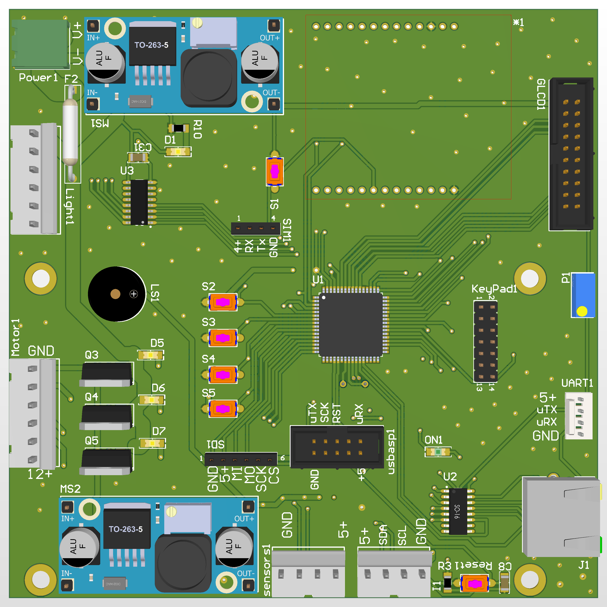
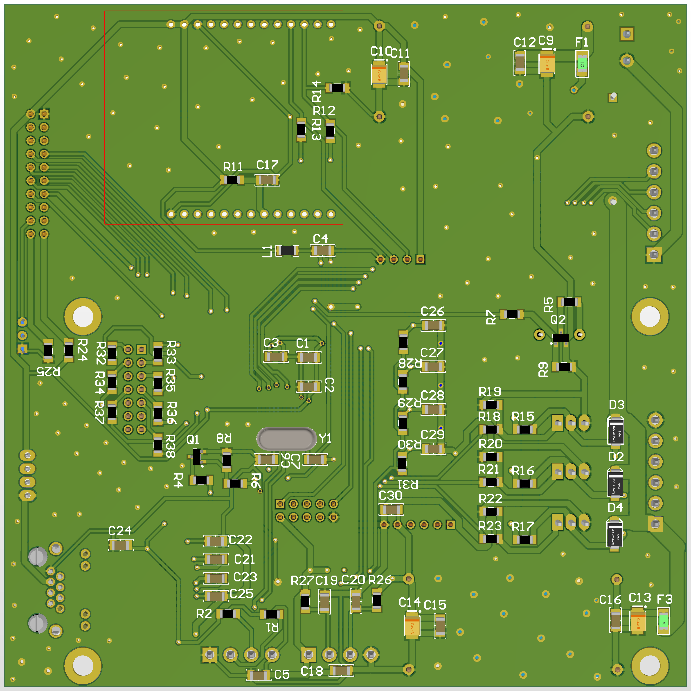

# vend pad PCB
this project use EC200U module for vend pad

| list of component |
| ----------------- |
|   Atmega64a       |
|   EC200U module   |
|   lighting        |
|   motor control   |
|   GLCD KS0108     |
|   keypad 3*4      |
|   IR-sensor       |
|   POS PORT        |

# Hardware Design

## PCB Layers

  
    
  

## List Components

<a href="Documentation/vend-002.pdf">
Download List Components PDF
</a>

## check List
- [ ] change voltage line per modules
- [ ] resize of light, motor, sensor and I2C socket
- [ ] change location of fuse
- [ ] change distance between SD Card and usbasp
- [ ] reduce of resistance in keypad line 
- [ ] change distance between power transistors for motors